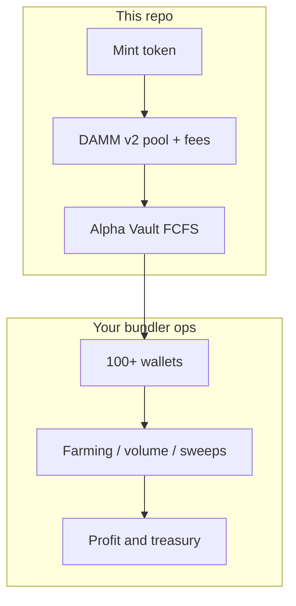

# Meteora Bundler Launch

**Meteora DAMM v2 + Alpha Vault (FCFS) launch toolkit** for teams that run **high wallet-count bundlers**-dozens to **100+ participant wallets**-around a single controlled token launch. This repository is the **on-chain launch spine**: mint the token, create the **custom pool** wired for Alpha Vault, then attach the **FCFS vault**. Distribution, deposits, fills, monitoring, and post-launch “farming” loops are usually orchestrated by your **bundler ops stack** (dashboard, scripts, or workers); this project keeps the **Meteora primitives** repeatable and env-driven.

> **Goal:** Launch with a fair timetable (delayed activation, caps), fee structure suited to **ongoing trading and LP fee capture**, and artifacts (`data/*.json`) your downstream automation can consume for **volume, sweeps, and profit realization** across many wallets.

---

## Why bundlers use this stack

- **Many wallets (100+):** You pre-seed or fund a large set of keys to spread flow, reduce single-wallet footprint, and run coordinated strategies after activation. This repo does **not** generate those wallets-it **anchors** the pool + vault so every downstream script targets one deterministic `POOL_ADDRESS` and vault config.
- **Farming & profit:** After go-live, typical objectives are **organic-looking flow**, **reward harvesting** (LP fees, incentives), and **consolidation** to treasury or “profit” wallets. A **dynamic fee layer on top of a scheduled base fee** keeps short-term MEV and toxic flow more expensive while longer-hold reads cleaner-supporting sustained activity without giving away the entire curve on block zero.
- **Dynamic fee + fixed base fee (Meteora pattern):** Pool creation here uses Meteora’s **time-scheduled base fee** (`FeeTimeSchedulerExponential`) **plus** optional **dynamic fee** (`POOL_ENABLE_DYNAMIC_FEE`, `POOL_DYNAMIC_BASE_FEE_BPS`). That combination:
  - caps runaway fee spikes via a **stable base schedule**;
  - lets **volatility / flow** push fees higher when the pool is stressed;
  - increases **claimable LP trading fees** in busy periods while keeping launch economics legible for participants.
- **Alpha Vault FCFS:** Staged deposits and a known **activation point** align the whole bundler fleet to the same clock-critical when coordinating **>100** signing keys.

---

## What this repository actually runs

| Step | Command | Role |
|------|---------|------|
| 1 | `npm run mint:token` | SPL / Token-2022 mint + metadata inputs; writes `data/latest-token-mint.json`. |
| 2 | `npm run launch:dammv2` | DAMM v2 **custom pool** (Alpha path) or config pool branch; fee ladder + optional dynamic fee; writes `data/latest-pool.json`. |
| 3 | `npm run create:alpha-vault:fcfs` | FCFS Alpha Vault bound to the pool; writes `data/latest-alpha-vault.json`. |

There is **no** built-in `distribute` / `fill` / `listen` in this package’s `package.json`-add your bundler runner or integrate with a larger mono-repo that consumes the JSON outputs.

---

## Architecture (high level)



---

## Quick start

```bash
git clone <your-fork> && cd Meteora-Bundler-Launch
npm install
cp .env.example .env   # create if missing; see Environment below
```

Minimum path (after `.env` is valid):

```bash
npm run mint:token
npm run launch:dammv2
npm run create:alpha-vault:fcfs
```

Use **`DRY_RUN=true`** while iterating; set to **`false`** only when you intend to land transactions on the cluster in your `RPC_URL`.

---

## Environment (essentials)

**Always required for real launches (see source for full validation):**

- `RPC_URL` - Solana HTTP RPC (quality matters at scale).
- `WALLET_SECRET_KEY` - Launch signer (base58 or JSON byte array).
- `CONFIG_ADDRESS` - Meteora DAMM v2 **config** PDA (fee bounds & pool genetics).
- `TOKEN_A_INPUT_AMOUNT_RAW` - Initial token A liquidity input (raw units).

**Pool / quote:**

- `QUOTE_MINT_TYPE` - `WSOL` or `USDC`.
- `CONNECT_ALPHA_VAULT_POOL` - `true` for custom Alpha-connected pool path (default intent of this project).
- `POOL_ACTIVATION_POINT_TS` - Unix seconds for delayed activation (bundler-friendly scheduling).
- `POOL_OUTPUT_PATH`, `TOKEN_MINT_OUTPUT_PATH`, `ALPHA_VAULT_OUTPUT_PATH` - artifact paths (defaults under `data/`).

**Fee ladder + dynamic component (profitable, busy pools):**

- `POOL_STARTING_FEE_BPS`, `POOL_ENDING_FEE_BPS` - ends of the exponential time schedule.
- `POOL_FEE_NUMBER_OF_PERIOD`, `POOL_FEE_TOTAL_DURATION_SEC` - schedule shape.
- `POOL_ENABLE_DYNAMIC_FEE` - `true` to add Meteora dynamic fee on top of the base schedule.
- `POOL_DYNAMIC_BASE_FEE_BPS` - base point for the dynamic curve.
- `POOL_COLLECT_FEE_MODE` - `0` BothToken / `1` OnlyB (match your **CONFIG**; affects where fees accrue).

**Alpha Vault (FCFS):**

- Caps, whitelist mode, deposit windows-see `src/alpha-vault-fcfs.ts` and Meteora docs for `ALPHA_FCFS_*` style variables present in your `.env`.

**Token mint:**

- Token program, decimals, supply, metadata, Pinata-see `src/token_mint.ts` and your `.env`.

---

## Operating model for 100+ wallets

1. **Launch once** with this repo; freeze `POOL_ADDRESS`, `alphaVault`, activation time in your ops DB.
2. **Fund many keys** from your custodian or generator; track nonce and SOL headroom per wallet.
3. **Deposit / trade** only inside published windows; respect cap and whitelist rules or you will waste txs.
4. **After activation**, run your farming policy:
   - scale in/out across wallets to avoid obvious clustering;
   - **claim LP fees** and rewards on a schedule aligned to gas and RPC rate limits;
   - sweep to cold or profit wallets with audit trails.
5. **Fees:** Re-read Meteora’s pool fee docs whenever you change `CONFIG_ADDRESS` or fee envs-misaligned `collectFeeMode` vs config is a common foot-gun.

---

## Security & compliance

- Never commit `.env` or keystores. Treat `data/*` outputs as sensitive when they contain mints, pool addresses, or paths to secrets.
- Use **dedicated launch keys**; rotate after mainnet campaigns.
- **Devnet first:** dry-run wiring, metadata, and clock math before touching mainnet.
- This software moves real funds; you are responsible for legal, tax, and exchange policy compliance in your jurisdiction.

---

## Troubleshooting

| Symptom | Check |
|--------|--------|
| `CONFIG_ADDRESS` errors | Config pubkey must match cluster; fee min/max must allow your init price. |
| Pool already exists | Change mint pair or reuse existing pool deliberately (`CONNECT_ALPHA_VAULT_POOL=false` path skips create in some branches-read `damm-v2-launch.ts`). |
| Vault create fails | `POOL_ADDRESS`, timing, caps, whitelist mode vs your `.env`. |
| “No dynamic fee” / unexpected fees | `POOL_ENABLE_DYNAMIC_FEE`, `POOL_DYNAMIC_BASE_FEE_BPS`, and on-chain config state. |

---

## Outputs (downstream automation)

- `data/latest-token-mint.json`
- `data/latest-pool.json`
- `data/latest-alpha-vault.json`

Point your bundler workers at these files or sync them to your control plane so all **100+** wallets share one source of truth.

---

## Roadmap ideas (not in repo today)

- Wallet batch generator + encrypted keystore export
- Deposit/fill orchestration service
- LaserStream listener + reactive rules
- Treasury sweeps and P&L reporting

---

## FCFS vs. your bundler fleet

**First-come, first-served** Alpha Vault fits high-wallet launches when:

- you want a **simple mental model**: valid deposits until cap, then crank fill before activation;
- **speed** and operational parallelism matter more than exact pro-rata allocation;
- your automation can **retry and race** deposit txs without a heavy allocation reconciliation step.

If you later need **Pro Rata**, you still keep the same pool/fee story; only the vault-side deposit accounting and communication change-this repo stays the canonical **pool + vault creation** layer.

---

## Mainnet checklist (operator)

- [ ] `CONFIG_ADDRESS` matches `POOL_COLLECT_FEE_MODE` and your Meteora fee preset (static vs dynamic-on-config nuances-verify on docs).
- [ ] `POOL_ENABLE_DYNAMIC_FEE` / `POOL_DYNAMIC_BASE_FEE_BPS` reviewed against expected first-hour volume.
- [ ] `POOL_ACTIVATION_POINT_TS` synchronized with public announcements and bundler job schedulers.
- [ ] All `data/*.json` backed up off-box; signer keys not stored next to repos in CI.
- [ ] RPC provider rate limits sized for **burst** from 100+ wallets (multiple providers or queueing).
- [ ] Runbook: who owns mint, pool tx, vault tx, and who aborts if RPC or clock skew.

---

## Token mint reminders (`token_mint.ts`)

Pinata / IPFS metadata is easy to get wrong under pressure. Before mainnet:

- Confirm **image** path or URL resolves publicly.
- Confirm **decimals** match downstream price UI and bundler math.
- Write down **mint authority** / freeze policy decisions; many launches revoke mint auth after mint-plan that before pool liquidity is locked.

---

## Disclaimer

This code executes **real on-chain transactions**. Testing and operational risk are yours. Past performance of a fee model does not guarantee future revenue; **dynamic fees** alter trader behavior and MEV-in backtests and production.

## License

Specify your license (MIT, Apache-2.0, proprietary, etc.) before public distribution.

## Contact

- Telegram: [@adelan](https://t.me/@ade1ane)
